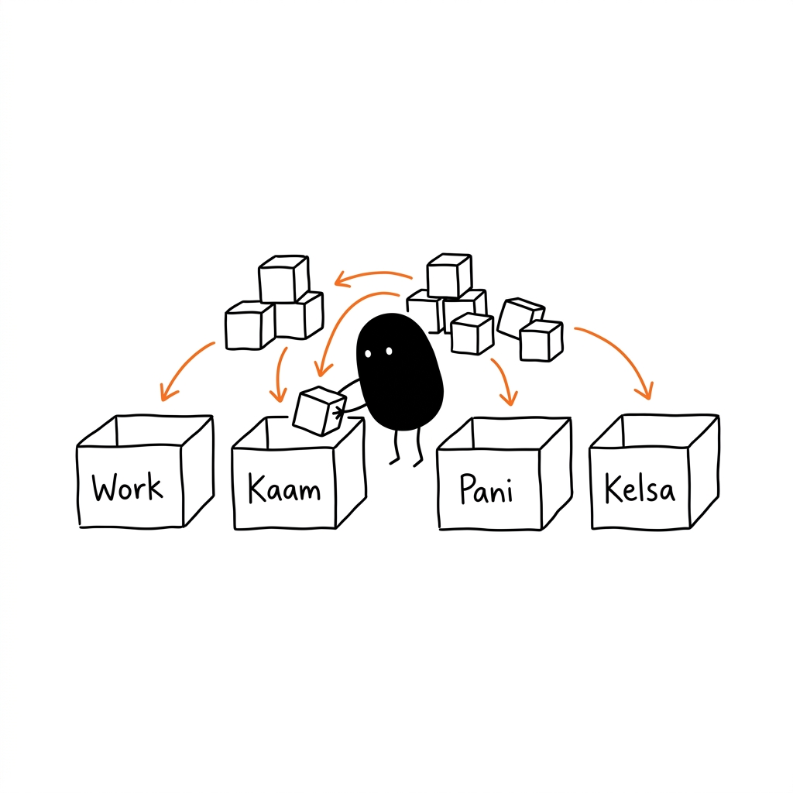
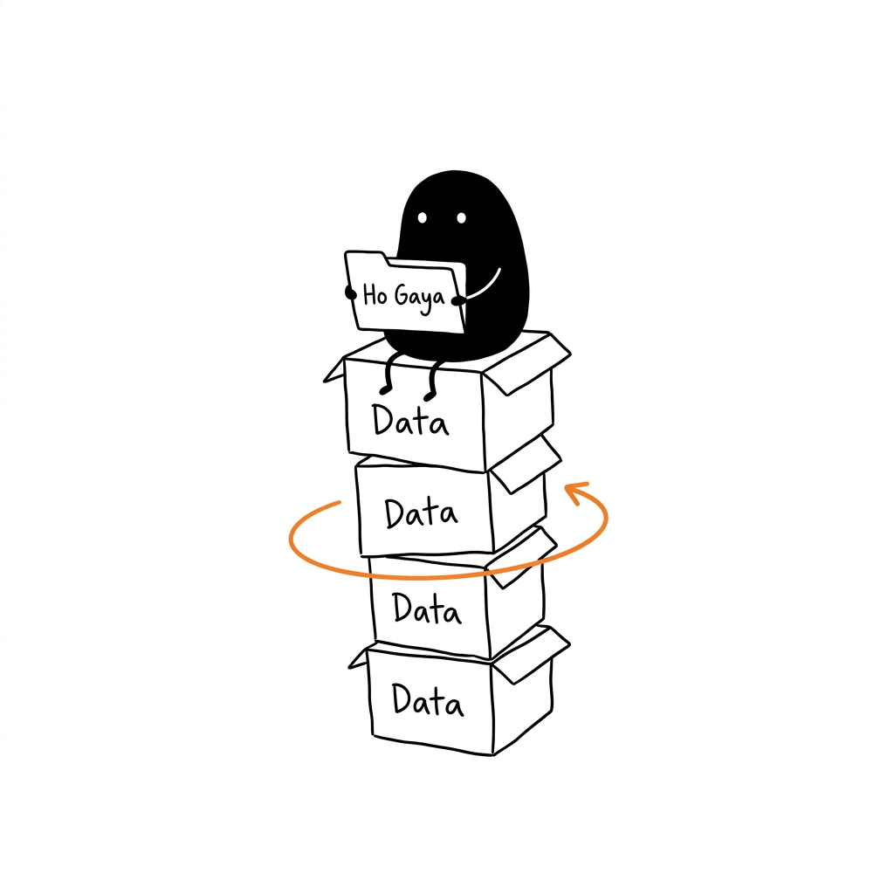
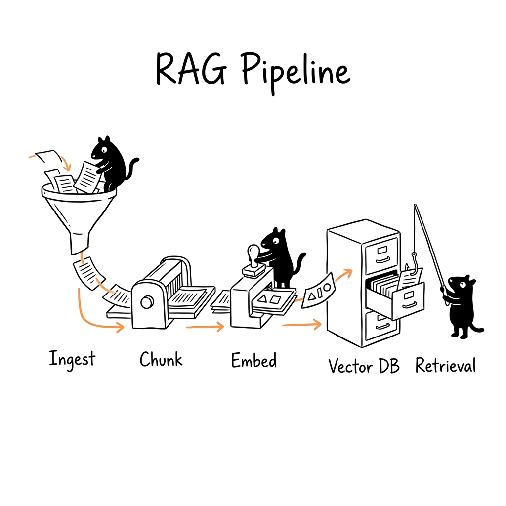
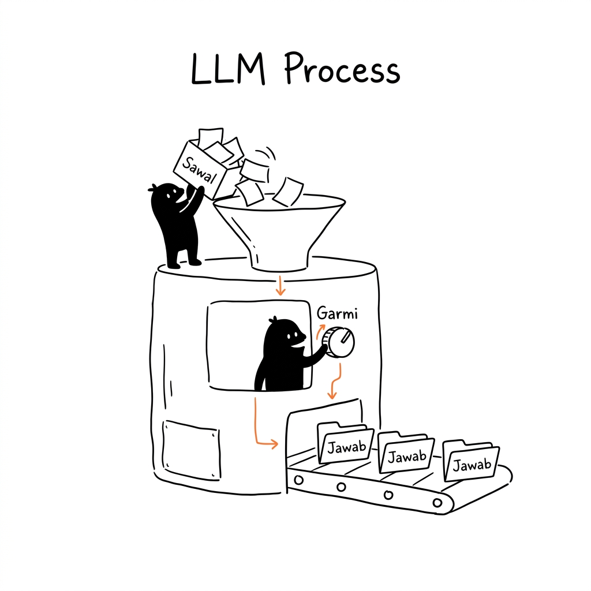
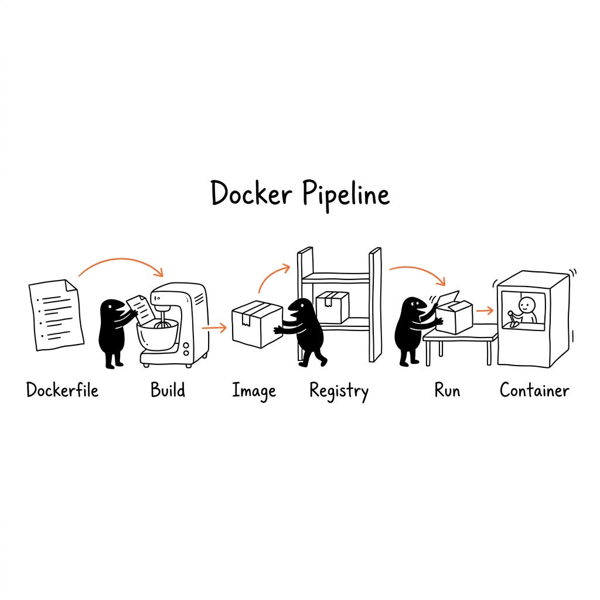
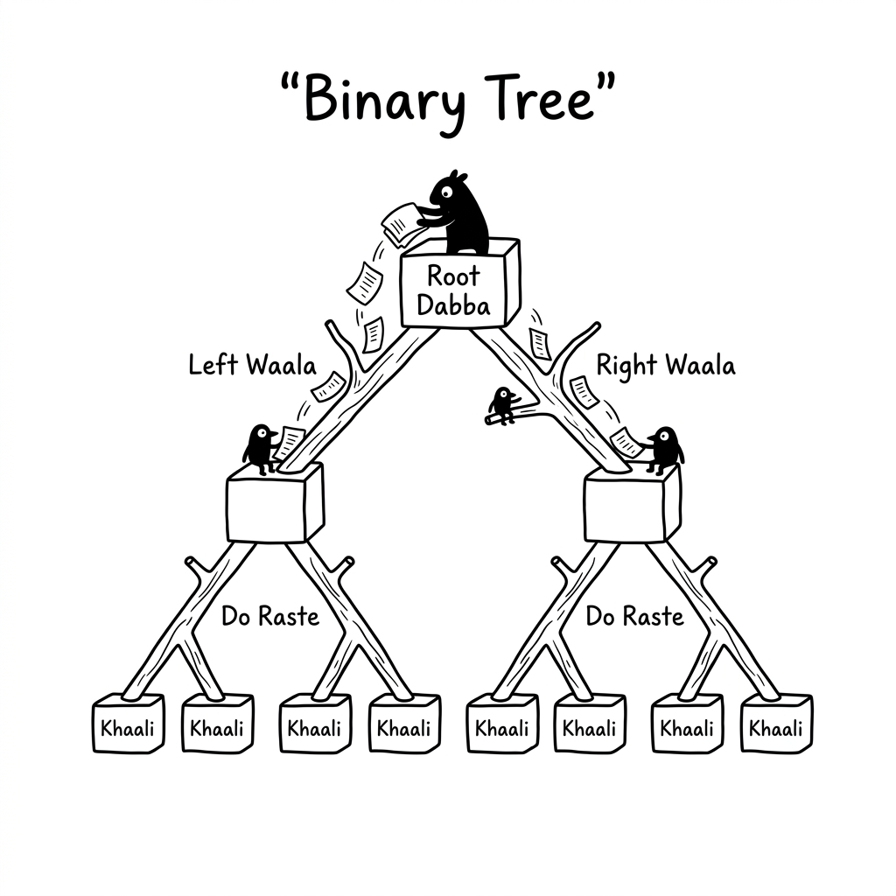
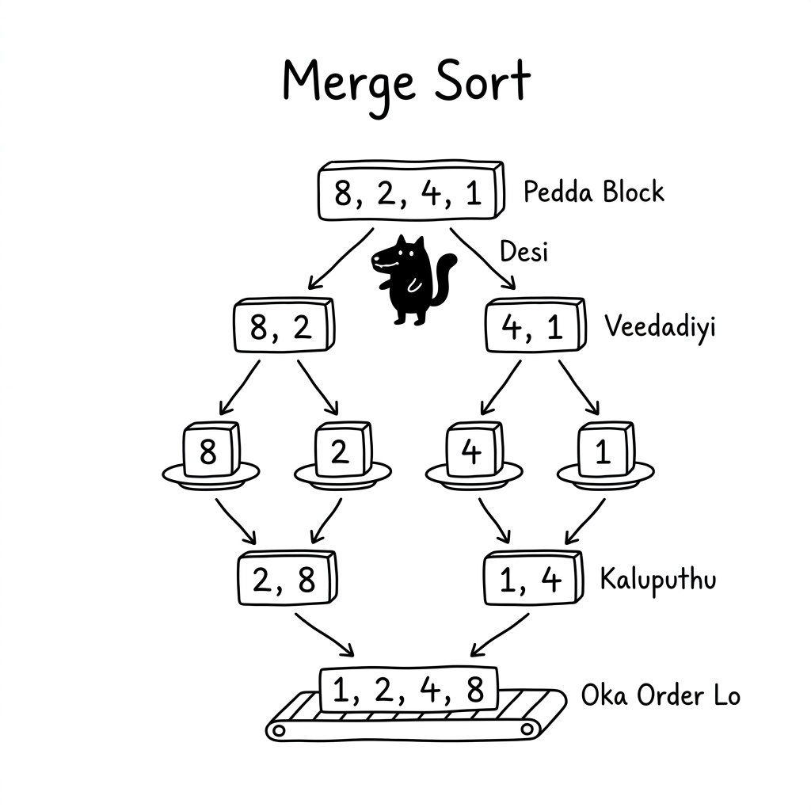

# DesiSketch Illustrations (AI Hand-Drawn Diagram Generator & Agent Skill)

> Translate text, workflows, and system metaphors into clean, wobbly, hand-drawn diagrams using a consistent visual grammar. Compatible with **Claude Code**, **Codex**, **Cursor**, **Windsurf**, and **Claude Projects**.
>
> 16:9 Horizontal | Desi IP | Pure White Hand-Drawn | Latin-Script Annotations (English, Hinglish, Tenglish, Kanglish) | AI Illustration Agent

---

## What is this Repository?

**DesiSketch Illustrations** is a cross-platform AI Agent Skill designed to guide AI coding assistants and chat agents (such as **Claude Code**, **Codex**, **Cursor**, **Windsurf**, or **Claude Projects**) in designing and generating inline illustrations for articles, blog posts, Notion documents, and technical workflows written in English or transliterated Indian languages (such as Hinglish, Tenglish, Kanglish, etc.).

Unlike ad-hoc DALL-E prompts or generic diagram tools, this skill enforces a consistent, reproducible visual grammar—combining a wobbly pen-sketch aesthetic with a deadpan operator character ("Desi") to make abstract concepts instantly readable and memorable. It is not a generic clipart generator or a polished slide template. Its core mission is to analyze the cognitive anchors of your text and translate one key judgment, workflow, comparison, state, or metaphor into a memorable 16:9 hand-drawn diagram.

The default character is **"Desi"**: a solid black creature with white dot eyes, thin legs, and a deadpan expression. Desi is not a decorative mascot, sticker, or corner-filler—Desi is an active, deadpan operator participating in the mechanics of the system.

In short: **We guide the AI to draw out the key conceptual action of the text, rather than just "adding a pretty picture."**

---

## Compatibility

This skill has been tested and verified across multiple AI assistant/agent interfaces:
*   **Codex / Antigravity IDE:** Fully supported, including automated visual feedback and built-in image tools.
*   **Claude Code (CLI):** Fully supported, using custom local skill directories and `/desisketch-illustrations` invocation.
*   **Cursor / Windsurf:** Verified using `.cursorrules` config.
*   **Claude.ai Projects:** Verified by pasting `SKILL.md` into Custom Instructions and uploading reference files.

---

## Who is this for?

**Perfect for:**
- Content creators writing technical blogs, Notion documentation, or newsletters.
- Creators explaining AI workflows, product design, or systems.
- People wanting to translate abstract concepts into clean, physical metaphors.
- Those who want a lighter, weirder, and more recognizable visual language than standard slide deck diagrams.
- AI team workforces (agents) that need a standardized, reproducible visual layout.

**Not suitable for:**
- Polished commercial marketing assets or corporate key visuals.
- Complex architectural block diagrams, detailed flowcharts, or full UML schematics.
- Cute, cartoonish, or babyish illustrations (emojis/stickers).
- Cramming long paragraphs, massive bullet lists, or entire course pages into a single image.
- Editable vector source files (SVG/Illustrator) that require strict node-by-node editing.

---

## What does it output?

**Default Outputs:**
- 16:9 horizontal article illustrations.
- A strategic shot list for your article (4–8 illustrations).
- The theme, core concept, structure type, Desi's action, and suggested Latin-script annotations for each drawing.
- PNG image assets saved to your workspace's `assets/<article-slug>-illustrations/` directory.

**Does NOT output:**
- Editable slides (.pptx, .key) or document PDFs.
- Editable vector layers (SVG/HTML/Canvas).
- Dense text-based informational posters.

---

## Visual Style

This skill uses the "absurd wobbly line product sketch" style:
- **Solid White Background:** No paper textures, warm tints, gradients, drop shadows, or background noise.
- **Black Hand-Drawn Outlines:** Thin, slightly wobbly pen lines representing a raw, manual sketch.
- **Negative Space:** The subject occupies 40%–60% of the canvas; at least 35% must remain empty.
- **Sparse Color Accents:** Black for outlines/labels, Orange for paths/flows, Red for critical points/warnings, Blue for supplementary notes/mental states.
- **Latin Script Only:** Minimal annotations (5-8 labels, 2-8 words each) written in the Latin alphabet (English writing) to ensure high rendering accuracy in AI generators. Mixed-language transliterated words (e.g., Hinglish: "Kaam Shuru", Tenglish: "Pani Shuru", Kanglish: "Kelsa Shuru", English: "Process Output") are highly encouraged.
- **Desi IP:** Must be the primary driver of the physical action (operating levers, carrying boxes, filtering files, etc.).

---

## Example Concepts (Calibration Samples)

Below are the available style-calibration drawings located in `examples/images/`:

### Multilingual Sorting (4 Languages)


### Square Desi (1:1)


### RAG System


### LLM Process


### Docker Pipeline


### Binary Tree (Hinglish Concept)


### Merge Sort (Tenglish Concept)


*Note: These are visual style calibrations (for stroke width, line jitter, and color density), not rigid layout templates. For each new article, the AI will invent a new metaphor.*

---

## Installation

Clone the repository:
```bash
git clone https://github.com/GunaTeja777/desisketch-illustrations.git
cd desisketch-illustrations
```

### Prerequisites (Image Generation Dependency)

This skill designs the visual strategy, plans the shot list, and generates image prompt guidelines, but it **requires your AI agent to have image-generation capabilities** to produce final PNGs:
*   **Claude Code (CLI):** Requires an MCP (Model Context Protocol) server or custom tool for image generation (e.g., connected to Midjourney, DALL-E, or Stable Diffusion APIs).
*   **Codex / Antigravity IDE:** Works out of the box using built-in image tools.
*   **Cursor / Windsurf / Claude.ai Projects:** Works when using a model or workspace configuration that has access to image generation features/extensions.

Choose the setup method depending on your environment:

### A. For Cursor & Windsurf IDEs
A `.cursorrules` file is provided at the root of this repository. 
1. Copy the `.cursorrules` file (or append its contents) into the root of your workspace:
   ```bash
   cp .cursorrules /path/to/your/workspace/
   ```
2. When you use the Cursor chat or composer, Claude/Gemini will automatically recognize the `DesiSketch` commands and follow the rules.

### B. For Claude Projects (Claude.ai Web UI)
If you are using Claude Projects in the web interface:
1. Create or open a **Project** in Claude.ai.
2. Click **Add Content** and upload the files inside the `desisketch-illustrations/references/` folder as project files.
3. Copy the contents of [desisketch-illustrations/SKILL.md](desisketch-illustrations/SKILL.md) and paste it into the **Custom Instructions** section of your Project.

### C. For Claude Code (CLI)
Copy the skill to your Claude custom skills directory:

*   **Global Installation** (available in any project/workspace):
    ```bash
    mkdir -p ~/.claude/skills
    cp -R ./desisketch-illustrations ~/.claude/skills/
    ```
*   **Project-level Installation** (only active inside this specific workspace):
    ```bash
    mkdir -p .claude/skills
    cp -R ./desisketch-illustrations .claude/skills/
    ```

### D. For Codex & OpenAI Agent Frameworks
Copy the skill to your agent configuration workspace's custom directory:
```bash
mkdir -p "${CODEX_HOME:-$HOME/.codex}/skills"
cp -R ./desisketch-illustrations "${CODEX_HOME:-$HOME/.codex}/skills/"
```

---

## How to Use

Depending on your agent platform, trigger the skill using its identifier:
*   **Claude Code:** Use the `/desisketch-illustrations` command or let Claude trigger it automatically.
*   **Codex & Other Agents:** Reference the skill as `$desisketch-illustrations`.

### 1. Illustration Planning (Shot List Strategy)
```text
[Claude Code] /desisketch-illustrations
[Codex/Other] Use $desisketch-illustrations

Do not generate images yet.
Analyze the article below, identify where visual explanations are needed, and output a shot list of around 5 images.
For each image, specify:
- Placement paragraph
- Theme
- Core metaphor
- Structure type
- Desi's action
- Suggested elements
- Recommended transliterated annotation labels (in Hinglish / Tenglish / Kanglish / English)

<Paste article text here>
```

### 2. Full Image Generation
```text
[Claude Code] /desisketch-illustrations
[Codex/Other] Use $desisketch-illustrations

Generate 4 illustrations for this article.
Requirements: 16:9 horizontal, pure white background, black hand-drawn outline, sparse red/orange/blue Latin-script annotations (e.g., Hinglish or Tenglish transliterated labels).
Do not create complex slides or cute mascot posters.

<Paste article text here>
```

### 3. Visualizing a Single Statement/Concept
```text
[Claude Code] /desisketch-illustrations
[Codex/Other] Use $desisketch-illustrations

Generate a 16:9 illustration for this concept:
"Trust isn't built by shouting; it is laid down tile by tile with concrete proof."
Make it bizarre but clean. Desi must carry out the physical action. Use 3-5 short Hinglish transliterated labels.
```

### 4. Editing: Removing Titles
```text
[Claude Code] /desisketch-illustrations
[Codex/Other] Use $desisketch-illustrations

Edit this image.
Remove the title "Workflow Diagram" and its underline from the top-left corner, leaving a clean white background. Do not add or change any other elements.
```

---

## Directory Structure

```text
.
├── README.md
├── LICENSE
├── NOTICE.md
├── examples/
│   ├── images/
│   │   ├── 09-desi-multilang.png
│   │   └── ...
│   └── prompts.md
└── desisketch-illustrations/
    ├── SKILL.md           <-- Universal Agent Skill (Claude Code, Codex, etc.)
    ├── agents/
    │   └── openai.yaml    <-- Codex platform-specific metadata (ignored by Claude)
    ├── assets/
    │   └── examples/
    │       ├── 09-desi-multilang.png
    │       └── ...
    └── references/
        ├── style-dna.md
        ├── desisketch-ip.md
        ├── composition-patterns.md
        ├── prompt-template.md
        └── qa-checklist.md
```

---

## License

MIT License. See [LICENSE](LICENSE).
